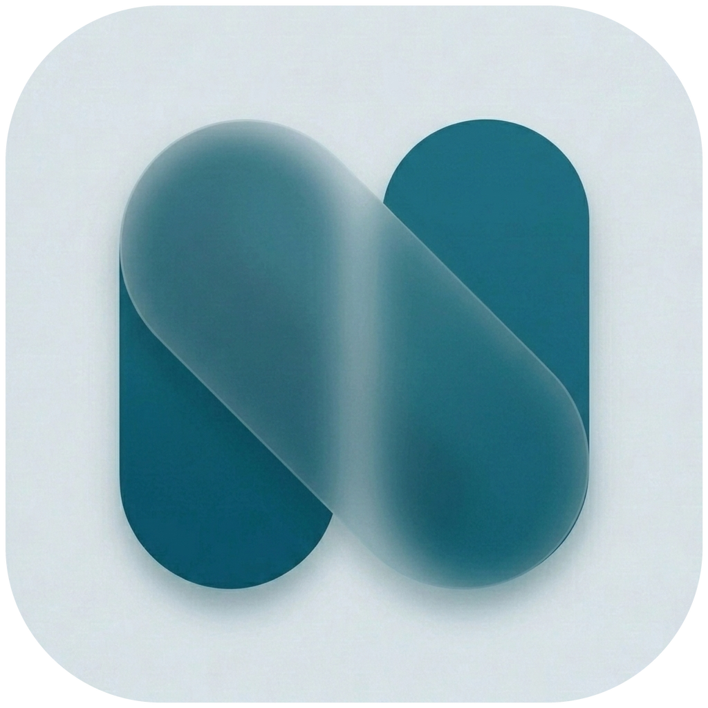
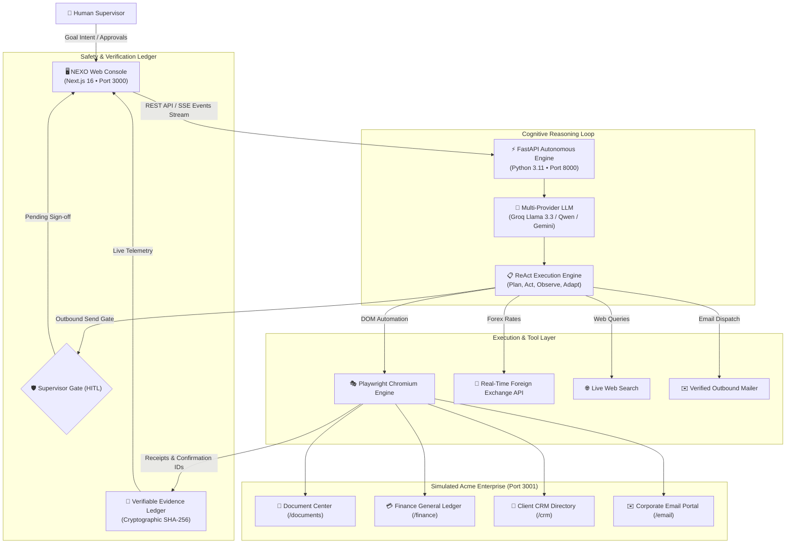

<div align="center">



# NEXO: Autonomous Enterprise AI Task Worker

**From Intent to Verified Execution.**  
*An autonomous AI task worker that deconstructs high-level business goals, operates internal company web portals via native browser automation, recovers gracefully from errors, and audits and cryptographically verifies tangible deliverables.*

<p align="center">
  <a href="https://nextjs.org/"></a>
  <a href="https://react.dev/"></a>
  <a href="https://fastapi.tiangolo.com/"></a>
  <a href="https://playwright.dev/"></a>
  <a href="https://groq.com/"></a>
  <a href="https://www.typescriptlang.org/"></a>
  <a href="https://tailwindcss.com/"></a>
  <a href="https://www.docker.com/"></a>
  <a href="https://github.com/OnkarGaikwad-astro"></a>
</p>

[Overview](#-overview) • [System Specifications](#-system-specifications) • [Architecture](#-architecture) • [Core Capabilities](#-core-capabilities) • [Quickstart & Setup](#-quickstart--setup-guide) • [Docker Deployment](#-docker-compose-deployment) • [Environment Config](#-environment-variables) • [API & SSE Specs](#-api--sse-specifications) • [Testing](#-testing--verification)

</div>

---

## 🌟 Overview

Traditional AI assistants stop at suggestions, markdown code blocks, and conversation. **NEXO bridges the gap between natural language intent and real-world verified execution.** 

When given a complex, multi-system enterprise goal — such as:
> *"Find Acme Corp's latest unpaid invoice, reconcile it in the Finance general ledger, verify Marcus Vance's email in CRM, and prepare a payment reminder draft."*

**NEXO autonomously:**
1. **Parses & Deconstructs Intent**: Formulates a structured multi-phase plan using cognitive reasoning.
2. **Navigates Real Web Applications**: Drives headless or headful Chromium instances using Playwright to interact with DOM inputs, data tables, modal dialogs, and navigation menus.
3. **Self-Heals on Error**: Detects unexpected web states (such as duplicate invoice submissions or missing fields) and adapts its trajectory without aborting.
4. **Enforces Safety Gates (HITL)**: Automatically halts execution before high-risk external actions (e.g. sending emails to real clients) until a human supervisor clicks **Approve** or **Reject**.
5. **Issues Verifiable Deliverables**: Extracts receipts, ledger entry IDs, and calculates **SHA-256 cryptographic proof hashes** for an audit-proof ledger.
6. **Streams Live Telemetry**: Broadcasts real-time step traces, viewport snapshots, memory updates, and logs to the web console via **Server-Sent Events (SSE)**.

---

## 📊 System Specifications

| Specification Dimension | Technology / Detail | Port / Endpoint |
| :--- | :--- | :--- |
| **Web Operations Console** | Next.js 16.3, React 19, TypeScript, Tailwind CSS v4, Lucide Icons | `http://localhost:3000` |
| **Simulated Acme Enterprise** | Next.js 16.3, React 19, Tailwind CSS v4 (Stateful isolated sandbox) | `http://localhost:3001` |
| **Autonomous Backend Engine** | FastAPI 0.115, Uvicorn 0.30, Python 3.10+ | `http://localhost:8000` |
| **Browser Automation Engine** | Playwright Chromium (Headless / Headful with viewport streaming) | Native / Sandboxed |
| **Primary Cognitive Engine** | Groq Cloud (`llama-3.3-70b-versatile` / `qwen/qwen3.8-27b`) | Ultralow latency inference |
| **LLM Provider Fallbacks** | OpenAI (`gpt-4o`), Google Gemini, and Rule-Based Deterministic Engine | Auto-failover |
| **Database & Persistence** | SQLite 3 via SQLAlchemy 2.0 ORM | `backend/nexo.db` |
| **Streaming Protocol** | Server-Sent Events (SSE) via `sse-starlette` | `GET /api/events` |
| **Tool Integrations** | Real SMTP (Gmail/Custom), Open Exchange Rates API, Tavily/DuckDuckGo Search | Pluggable tool registry |
| **Security & Cryptography** | SHA-256 evidence hashing, Supervisor Gate (HITL), CORS origin protection | Zero sandbox leakage |

---

## 🏗️ Architecture



---

## 🚀 Core Capabilities

### 1. 🤖 Phased ReAct Cognitive Loop
NEXO implements an observable 7-phase cognitive lifecycle for every user objective:
- **`UNDERSTAND`**: Parses targets, extracts invoice identifiers, detects email parameters, and validates constraints.
- **`PLAN`**: Synthesizes a deterministic execution pipeline with dependencies.
- **`EXECUTE`**: Navigates to target routes, selects DOM elements, fills inputs, and triggers buttons.
- **`OBSERVE`**: Captures viewport screenshots, reads post-interaction DOM states, and inspects status codes.
- **`ADAPT`**: Self-heals when encountering barriers (e.g., detecting duplicate invoice error flags and switching from insertion to verification mode).
- **`VERIFY`**: Validates deliverables against ground truth before finalizing task status.
- **`COMPLETE`**: Compiles deliverables, computes SHA-256 hash proofs, and concludes the audit trail.

### 2. 🖥️ Scaled 2x Mini-Desktop Viewport Preview
The web console features an interactive viewport preview (`scale(0.5)`) rendering live high-resolution desktop perspectives of the simulated enterprise suite. You can observe the agent navigate pages, fill forms, and process records in real time.

### 3. 🛡️ Human-in-the-Loop (HITL) Supervisor Gates
NEXO prevents unwanted side-effects. When an agent attempts an irreversible or external action (such as dispatching an email to an external vendor), the task pauses in state `WAITING_FOR_APPROVAL`. A supervisor can review the recipient, subject, and body, then click **Approve & Send** or **Reject**.

### 4. 🔏 Cryptographic SHA-256 Deliverable Ledger
Every result produced by the worker includes:
- Extracted system reference keys (e.g., `INV-2048`, Transaction ID `TX-88219`, Marcus Vance CRM profile).
- Timestamped audit log entries with step-by-step reasoning.
- A **SHA-256 cryptographic hash** of the deliverable payload, ensuring end-to-end provenance.

### 5. 🏢 Pre-Built Acme Enterprise Sandbox (`apps/company-sim`)
NEXO includes a stateful internal company suite pre-configured for evaluation:
- **📄 Document Center (`/documents`)**: Vendor invoices (`INV-2048`, `INV-2039`, `INV-1092`, `INV-5521`), PDF previews, due dates, and metadata.
- **💳 Finance Portal (`/finance`)**: Accounts payable ledger, general ledger reconciliation, and duplicate invoice detection safeguard.
- **👥 Client CRM (`/crm`)**: Corporate directory, account managers, credit standings, and contact records.
- **✉️ Corporate Email (`/email`)**: Full enterprise correspondence client with composer, draft box, and outbox logs.

---

## 📦 Quickstart & Setup Guide

### System Prerequisites
Ensure the following tools are installed on your host system:
- **Node.js**: `v18.0.0` or higher (Node 20+ recommended)
- **Python**: `v3.10` or higher
- **Git**
- *(Optional)* **Docker & Docker Compose**

---

### Method 1: Local Native Setup (Recommended for Development)

#### Step 1: Clone the Repository
```bash
git clone https://github.com/OnkarGaikwad-astro/Nexo.git
cd Nexo
```

#### Step 2: Configure Environment Variables
Copy the environment template in the `backend/` directory:
```bash
# On Windows PowerShell:
Copy-Item backend/.env.example backend/.env

# On Linux / macOS:
cp backend/.env.example backend/.env
```

Open `backend/.env` in your editor and add your [Groq API Key](https://console.groq.com/keys) (Free):
```env
GROQ_API_KEY=gsk_your_groq_api_key_here
COGNITIVE_MODEL=llama-3.3-70b-versatile
HEADLESS=true
```
*(Note: If no API key is provided, NEXO operates using its deterministic rule-based cognitive engine).*

---

#### Step 3: Setup & Start Backend Service (Port 8000)
Open your first terminal window:

```bash
cd backend

# Create virtual environment
python -m venv venv

# Activate virtual environment:
# Windows (PowerShell):
.\venv\Scripts\Activate.ps1
# Windows (CMD):
.\venv\Scripts\activate.bat
# Linux / macOS:
source venv/bin/activate

# Install dependencies & Playwright Chromium
pip install -r requirements.txt
playwright install chromium

# Launch FastAPI development server
uvicorn app.main:app --host 127.0.0.1 --port 8000 --reload
```
✅ **Backend API verified at**: `http://127.0.0.1:8000` (Docs at `http://127.0.0.1:8000/docs`)

---

#### Step 4: Setup & Start Company Sandbox (Port 3001)
Open your second terminal window:

```bash
cd apps/company-sim
npm install
npm run dev
```
✅ **Company Sandbox verified at**: `http://localhost:3001`

---

#### Step 5: Setup & Start Web Operations Console (Port 3000)
Open your third terminal window:

```bash
cd apps/web
npm install
npm run dev
```
✅ **NEXO Operations Console live at**: `http://localhost:3000`

---

## 🐳 Docker Compose Deployment

NEXO provides ready-to-run container definitions for all three services (`backend`, `company-sim`, `web`):

```bash
# 1. Set your Groq API key in the environment or .env
echo "GROQ_API_KEY=gsk_your_groq_api_key_here" >> backend/.env

# 2. Build and launch all services in detached mode
docker compose up --build -d
```

### Checking Container Health
```bash
# View container status
docker compose ps

# View live aggregate logs
docker compose logs -f

# Stop all services
docker compose down
```

### Service Map in Docker
| Service | Container Name | Port Mapping | Description |
| :--- | :--- | :--- | :--- |
| **`web`** | `nexo-web` | `3000:3000` | Next.js Operations Console |
| **`company-sim`** | `nexo-company-sim` | `3001:3001` | Acme Corporation Internal Web Systems |
| **`backend`** | `nexo-backend` | `8000:8000` | FastAPI Engine + Playwright Chromium |

---

## ⚙️ Environment Variables

All core backend configuration resides in `backend/.env`. Here is the complete configuration matrix:

| Variable | Required | Default Value | Description |
| :--- | :---: | :--- | :--- |
| `GROQ_API_KEY` | Recommended | *(Empty)* | Groq API Key for Llama-3.3 and Qwen models. Free at [console.groq.com](https://console.groq.com/keys). |
| `COGNITIVE_MODEL` | No | `llama-3.3-70b-versatile` | Primary reasoning model name (e.g. `llama-3.3-70b-versatile`, `qwen/qwen3.8-27b`). |
| `OPENAI_BASE_URL` | No | `https://api.groq.com/openai/v1` | Custom OpenAI-compatible endpoint. |
| `LLM_API_KEY` | No | *(Empty)* | Alternative API key alias for OpenAI-compatible providers. |
| `COMPANY_SIM_URL` | No | `http://localhost:3001` | Base URL of the sandboxed company systems. |
| `BACKEND_URL` | No | `http://localhost:8000` | Base URL of the FastAPI backend. |
| `WEB_URL` | No | `http://localhost:3000` | Base URL of the web console. |
| `HEADLESS` | No | `true` | When `true`, runs Chromium headlessly. Set `false` for local UI browser popups. |
| `SMTP_HOST` | No | `smtp.gmail.com` | SMTP host for verified external email delivery. |
| `SMTP_PORT` | No | `587` | SMTP port (TLS). |
| `SMTP_USER` | No | *(Empty)* | Email address for SMTP sender authentication. |
| `SMTP_PASSWORD` | No | *(Empty)* | SMTP app password (e.g. Google App Password). |
| `SMTP_FROM` | No | *(Empty)* | Sender display address. |
| `TAVILY_API_KEY` | No | *(Empty)* | Optional key for Tavily live search. Falls back to DuckDuckGo if unset. |

---

## 📡 API & SSE Specifications

NEXO exposes an asynchronous REST and real-time streaming API on port `8000`:

### Core Endpoints

#### `POST /api/tasks`
Create a new autonomous task.
```bash
curl -X POST http://localhost:8000/api/tasks \
  -H "Content-Type: application/json" \
  -d '{"goal": "Find Acme Corp latest unpaid invoice, reconcile it in Finance, and draft an email."}'
```
**Response (200 OK):**
```json
{
  "id": 1,
  "goal": "Find Acme Corp latest unpaid invoice...",
  "status": "PENDING",
  "created_at": "2026-10-09T08:00:00Z"
}
```

#### `POST /api/tasks/{id}/run`
Spawn the autonomous agent worker process for the given task.
```bash
curl -X POST http://localhost:8000/api/tasks/1/run
```

#### `GET /api/tasks/{id}`
Retrieve task status, reasoning steps, execution artifacts, and deliverable proofs.

#### `POST /api/tasks/{id}/approve`
**Human-in-the-Loop Gate**: Approve a pending sensitive action (such as sending an outbound email).
```bash
curl -X POST http://localhost:8000/api/tasks/1/approve
```

#### `POST /api/tasks/{id}/reject`
**Human-in-the-Loop Gate**: Reject a pending sensitive action.
```bash
curl -X POST http://localhost:8000/api/tasks/1/reject
```

#### `GET /api/events`
**Server-Sent Events (SSE)** endpoint. Streams live telemetry to the web console:
- Event types: `step_update`, `thought`, `screenshot`, `action_result`, `approval_needed`, `task_complete`.

#### `GET /api/memory`
Retrieves persistent enterprise memory, cached entity attributes, DOM selector maps, and business rules.

#### `GET /api/stats`
Telemetry statistics: Total tasks, success rate, and active agent execution count.

---

## 🎯 Verified Demonstration Scenarios

NEXO includes 1-click interactive preset goals in the console header:

| Preset Trigger | Target Goal Description | Portals Touched | Key Safeguards Evaluated |
| :--- | :--- | :--- | :--- |
| **📑 Scan Acme Invoices** | Find latest invoice for Acme Corp and extract invoice number, amount, and due date. | Document Center | DOM element parsing & receipt validation |
| **💳 Sync General Ledger** | Process invoice `INV-2048` and record it into the Finance general ledger. | Finance Portal | **Duplicate Detection Safeguard & Self-Healing** |
| **👥 Verify CRM Profile** | Search Marcus Vance in Client CRM and verify contact profile and unpaid balances. | Client CRM | Sandbox memory cache & contact resolution |
| **✉️ Send Payment Email** | Compose and dispatch an invoice payment reminder with recipient verification. | Corporate Email / SMTP | **HITL Supervisor Gate (Approval Required)** |
| **⚡ Multi-Step Pipeline** | Extract unpaid invoice $\rightarrow$ enter in Finance $\rightarrow$ prepare payment reminder email. | Docs + Finance + Email | End-to-end multi-app navigation & SHA-256 ledger proof |
| **💱 Real-Time Forex** | Live multi-currency conversion with automatic NLP parsing (e.g. *250 dirham to INR*). | Exchange Rate API | Live rate telemetry & currency formatting |
| **🌐 Live Web Search** | Real-world DuckDuckGo search query with Chromium DOM extraction and live viewport captures. | Chromium Engine | External web navigation & content parsing |

---

## 🧪 Testing & Verification

NEXO features an end-to-end test runner validating API health, ReAct multi-system execution, duplicate invoice recovery, and supervisor gating.

### Automated Test Runner
Ensure `backend` and `company-sim` are running, then execute:
```bash
cd backend
python tests/run_tests.py
```

### Pytest Unit & Integration Tests
```bash
cd backend
pytest -v
```

### Validate Production Frontend Builds
```bash
# Web Operations Console
npm run build --prefix apps/web

# Company Simulator
npm run build --prefix apps/company-sim
```

---

## 📂 Project Directory Structure

```text
Nexo/
├── assets/
│   ├── nexo-icon.png               # NEXO Brand Squircle Icon
│   └── favicon.ico                 # Platform Favicon
├── apps/
│   ├── web/                        # Next.js 16 Web Operations Console (Port 3000)
│   │   ├── src/app/page.tsx        # 3-Column Autonomous Operations Console
│   │   ├── src/app/execution/      # Live Step Trace & Cognition Inspector
│   │   ├── src/app/memory/         # Enterprise Memory & Rules Registry
│   │   ├── src/app/tasks/          # Historical Tasks Ledger
│   │   ├── Dockerfile              # Next.js Production Container Spec
│   │   └── package.json            # Dependencies & Scripts
│   └── company-sim/                # Enterprise Sandbox Environment (Port 3001)
│       ├── src/app/page.tsx        # Company Systems Navigation Hub
│       ├── src/app/documents/      # Vendor Invoices & Document Center
│       ├── src/app/finance/        # Accounts Payable & General Ledger
│       ├── src/app/crm/            # Client Contacts & Account Standing
│       ├── src/app/email/          # Corporate Outbox, Drafts & Dispatcher
│       ├── Dockerfile              # Sandbox Production Container Spec
│       └── package.json            # Dependencies & Scripts
├── backend/                        # FastAPI Autonomous Engine (Port 8000)
│   ├── app/
│   │   ├── agent/
│   │   │   ├── agent.py            # ReAct Execution Loop & Self-Healing Engine
│   │   │   ├── llm.py              # Multi-Provider Cognitive Engine (Groq / Gemini)
│   │   │   ├── executor.py         # Playwright Chromium Session Controller
│   │   │   └── tools/              # Forex, Web Search, and SMTP Mailer Tools
│   │   ├── config.py               # Dynamic Service URL & Settings Resolution
│   │   ├── database.py             # SQLite Connection & Session Manager
│   │   ├── main.py                 # REST Endpoints & Real-Time SSE Streamer
│   │   ├── models.py               # SQLAlchemy Database Schemas & Audit Ledger
│   │   └── run_browser.py          # Isolated Playwright Worker Runner
│   ├── tests/
│   │   ├── test_nexo_autonomous.py # Automated Pytest Suite
│   │   └── run_tests.py            # End-to-End Scenario Verification Runner
│   ├── .env.example                # Documented Environment Variables Template
│   ├── Dockerfile                  # Python 3.11 + Playwright Chromium Container Spec
│   └── requirements.txt            # Python Dependencies
├── docker-compose.yml              # Complete Multi-Container Orchestration Spec
├── .env.example                    # Root Configuration Template
├── LICENSE                         # MIT License
└── README.md                       # Master System Documentation
```

---

## 🛠️ Troubleshooting & FAQ

<details>
<summary><b>1. Playwright fails with "Executable doesn't exist" or browser missing</b></summary>

Playwright Chromium binaries need to be installed once inside the active Python environment:
```bash
cd backend
# With virtual environment activated:
playwright install chromium
```
On Linux headless systems, install system dependencies via:
```bash
playwright install --with-deps chromium
```
</details>

<details>
<summary><b>2. Port conflict: Port 3000, 3001, or 8000 is already in use</b></summary>

- If port `3000` is taken, Next.js will prompt to use another port. However, for consistency with `apps/company-sim` and `backend`, free the ports or update the corresponding `.env` and `package.json` port flags.
- To check active ports on Windows:
  ```powershell
  Get-NetTCPConnection -LocalPort 3000,3001,8000
  ```
- To check active ports on Linux / macOS:
  ```bash
  lsof -i :3000,3001,8000
  ```
</details>

<details>
<summary><b>3. Do I need a paid API key to run NEXO?</b></summary>

No! NEXO is designed to run completely free:
- **Groq Cloud** provides a free tier with high rate limits for `llama-3.3-70b-versatile` and `qwen/qwen3.8-27b`.
- If no API key is provided at all, NEXO automatically falls back to its **Deterministic ReAct engine**, executing realistic workflows across the simulated enterprise suite without external API calls.
</details>

<details>
<summary><b>4. How does the Human-in-the-Loop (HITL) gate work?</b></summary>

When a task involves sending an outbound email or modifying critical records, the agent initiates the action and pauses in `WAITING_FOR_APPROVAL`. In the Web Console (`http://localhost:3000`), a supervisor confirmation modal will appear. The agent will not proceed until you click **Approve** or **Reject**.
</details>

<details>
<summary><b>5. Windows PowerShell Execution Policy error when activating venv</b></summary>

If you receive `execution of scripts is disabled on this system`, run:
```powershell
Set-ExecutionPolicy -Scope Process -ExecutionPolicy Bypass
.\venv\Scripts\Activate.ps1
```
</details>

---

## 🛡️ Trust, Security & Compliance

NEXO incorporates enterprise security standards by design:
- **Zero Cross-Environment Pollution**: The simulated company suite runs on an isolated network boundary (port 3001), preventing access to unauthorized production systems.
- **Supervisor Authorization Gate**: High-impact mutations and outbound messages are gated behind authenticated supervisor sign-off.
- **Cryptographic Audit Provenance**: Extracted values, receipts, and deliverables are hashed using SHA-256 for immutable audit trails.

---

<div align="center">

Crafted with ❤️ by **Onkar Gaikwad**

*NEXO • Autonomous Enterprise AI Task Worker*

</div>
